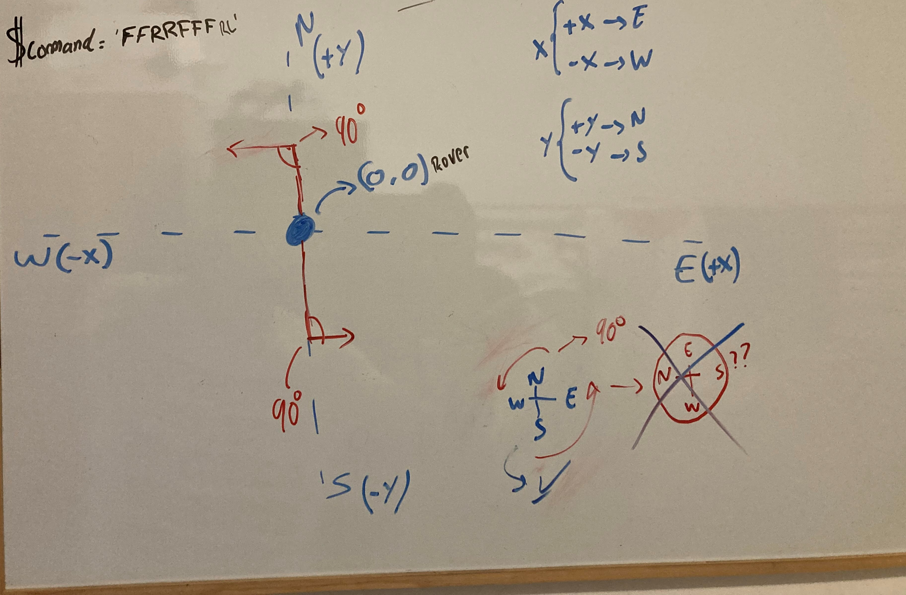

# mars-rover

## Que he utilizado?

<ul>
    <li>PHP</li>
    <li>PHPUnit</li>
</ul>

Mediante **PHPUnit** se han planteado una serie de tests para estudiar el movimiento de **Rover**

## PLANTEAMIENTO DEL MOVIMIENTO DE ROVER

Para entender su movimiento se ha empleado el **PLANO CARTESIANO** el cual permitió estudiar su movimiento en las 4 direcciones (**N, S, E, W**).

Observaciones:
<ul>
    <li>Rover inicialmente se encuentra en las coordenadas (0,0).</li>
    <li>'N' es 'Y' positiva</li>
    <li>'E' es 'X' positiva</li>
    <li>'S' es 'Y' negativa</li>
    <li>'W' es 'X' negativa</li>
</ul>

Cuando **Rover** gira a la derecha o a la izquierda hace un giro de **Xº** (vamos a poner que cada giro que hace es de 90º), cuando realiza este giro mantiene su posision en los ejes **X,Y**, es decir, cuando **Rover** recibe los comandos como **L** o **R** él sólo gira actualizando así su orientacion en los ejes **N,S,E,W**.